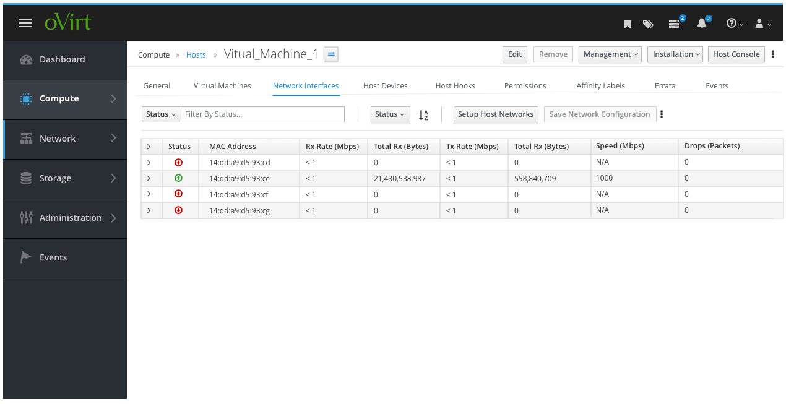
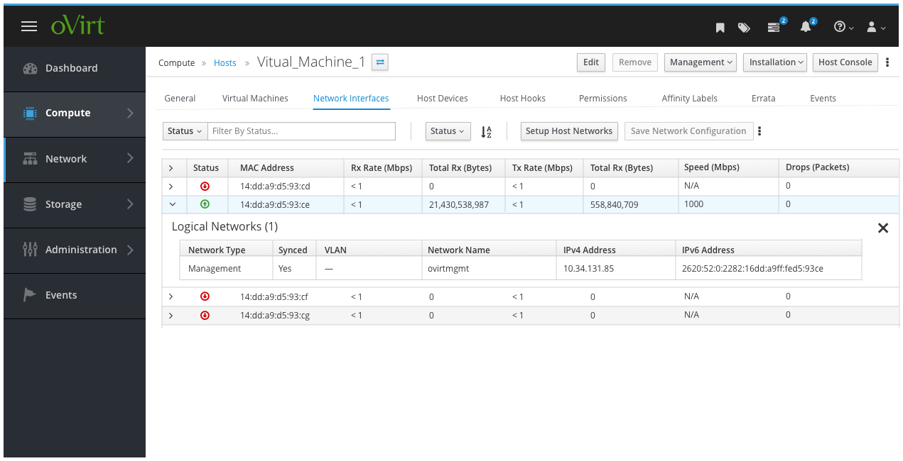

# Host - Network Interfaces

After clicking on a specific Host, the user can navigate to view the Network Interfaces for that host. This view should make use of a table with a toolbar for easy filtering and sorting.  

Also, it should be extended to allow for the user to expand and collapse each row to view any Logical Networks.

