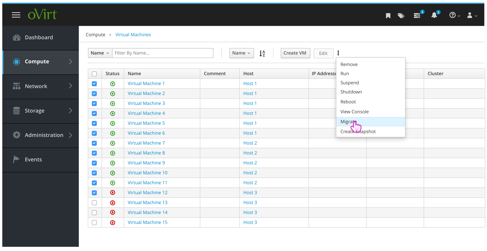
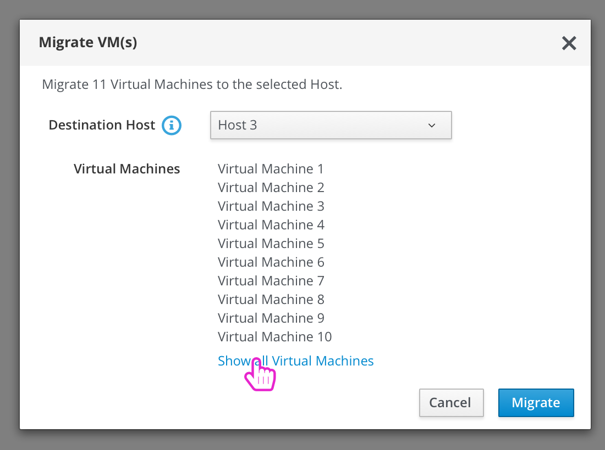
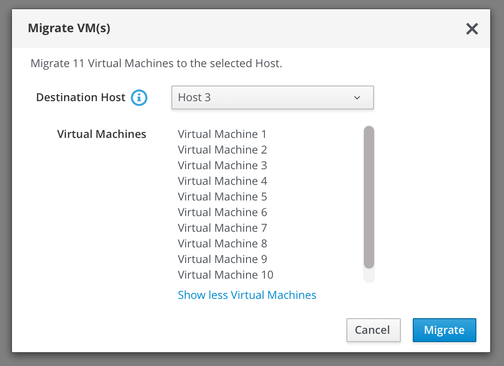
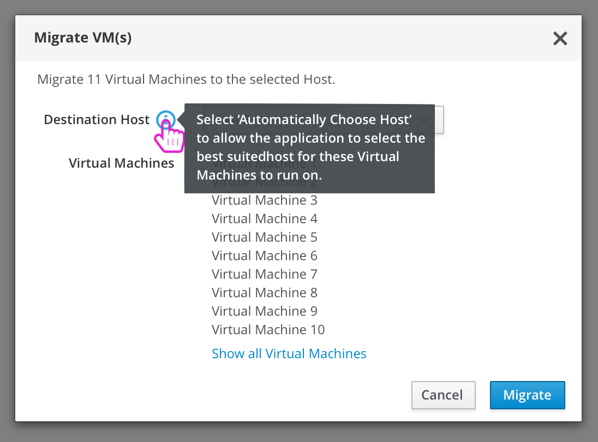
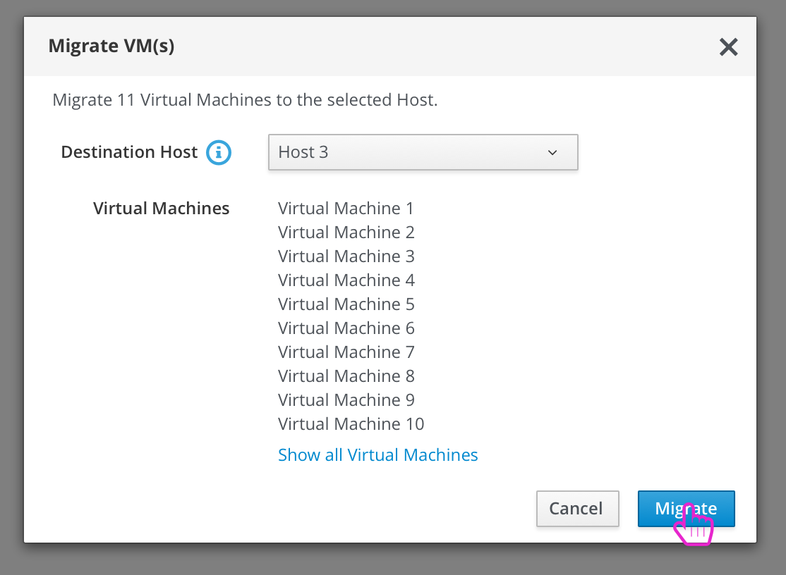
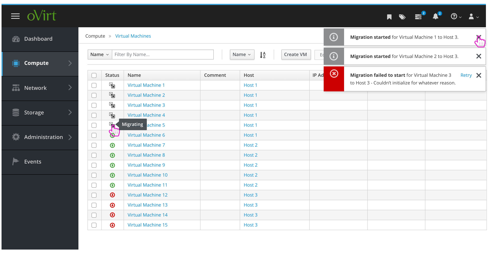
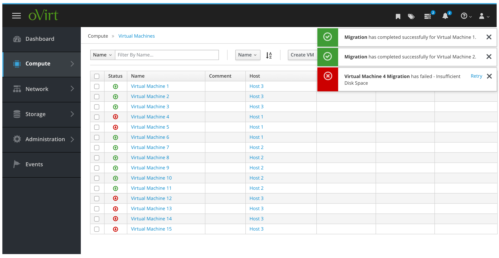

# Migrate Virtual Machines

The admin has the option to migrate one or more virtual machines from one host
another. Here is how the scenario could go:

### Select VMs, choose Migrate action
The admin navigates to the Virtual Machines section, selects the VMs that they wish to migrate and chooses the “Migrate” action:

### Migrate VMs Dialog
The admin is presented with the “Migrate VM(s)” dialog where they will see a confirmation of the VMs they selected previously, and be asked to choose a Destination Host. NOTE: If the user selects a VM that isn’t running, it will not appear in this list.

### View All VMs
The admin can select to view all of the Virtual Machines in the list if they’d like to review them. These will be presented in a list with a scrollbar for scaling:

### Info Tip on Destination Host
The Destination Host field will include some field level help with a tooltip to explain the use of selecting “Automatically Choose Host”:

### Kick Off Migration
When ready, the user selects to Migrate these VMs:

### Monitor Migration
After selecting to Migrate, the modal is closed and the user can see updates to this process via Toast Notifications, Events/Alerts, as well as an icon change in the VMs table. Migrations that start successfully will produce an informational toast while any VMs that don’t initialize will product an error toast:

### Migration Completion
After migration has either completed or failed (doesn’t initialize, fails for another reason) the admin will receive toast notifications. These will most likely come individually, but if we would like to, they can be grouped together as well:

