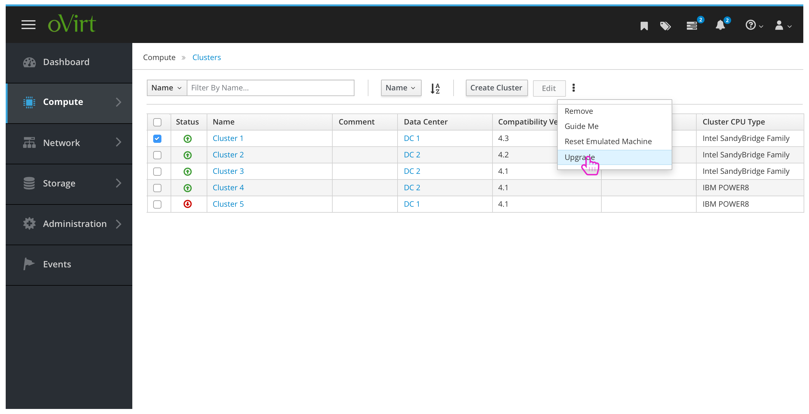
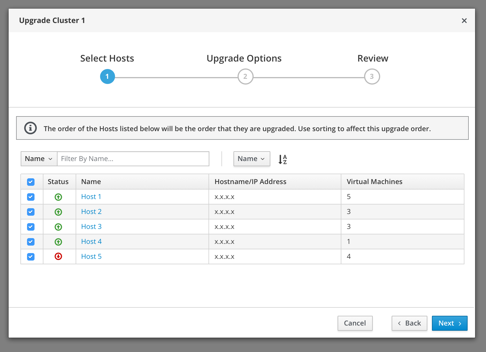
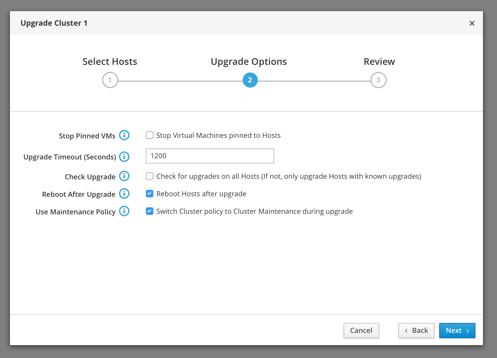
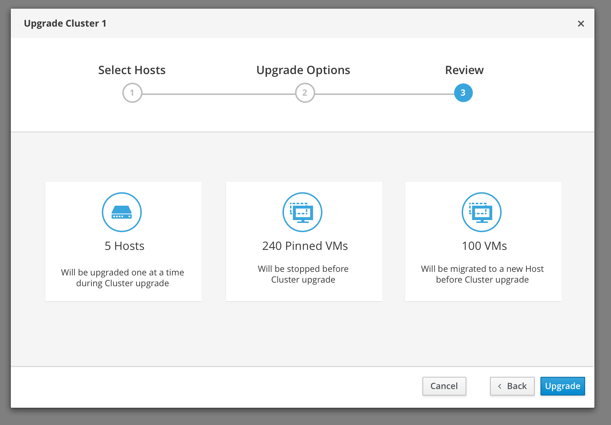
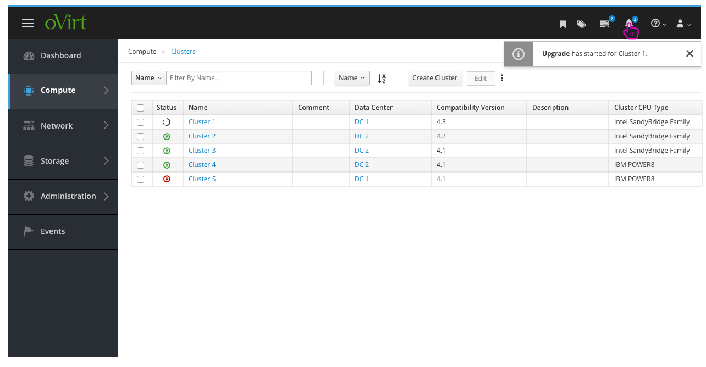
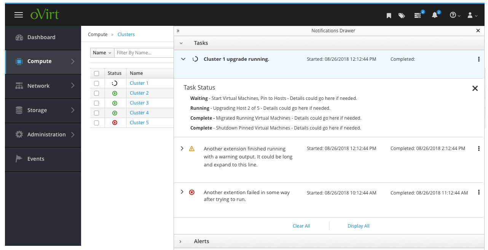

# Upgrade Cluster

The admin can choose to upgrade a cluster in their environment. This feature design is dependent on the Ansible playbook that will be used:
https://github.com/oVirt/ovirt-ansible-cluster-upgrade/blob/master/README.md

### Select Cluster
The Admin navigates to the Cluster view, selects a Cluster (initial design will support only one Cluster Upgrade at once), and chooses “Upgrade” from the menu.

### Select Hosts
The Admin is presented with the Cluster Upgrade wizard where the first step is to select which Hosts from the Cluster they would like to upgrade. They can filter and sort this list to make it easy to select/unselect Hosts to upgrade if needed.

### Upgrade Options
Step 2 of the wizard presented the admin with a number of additional options that affect the Virtual Machines that will be stopped during the Upgrade.

### Review
The last step of the wizard is a confirmation of the Hosts and Virtual Machines that will be affected during the upgrade process.

### Monitoring the Upgrade
After kicking off the upgrade process, the admin will see a toast notification to confirm that the upgrade started. From there they can drill into the Notification Drawer to find more details.

### Detailed Status of Upgrade
The admin can expand the Notification Drawer and the Task to view more detailed information gathered from the Ansible Playbook output.

