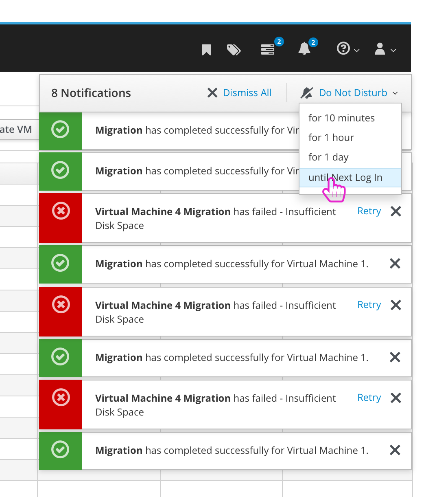

# Notifications

The Notification Drawer and Toast Notifications are used within oVirt to let the user know about tasks that have been kicked off along with any state changes or alerts.

### Toast Notifications
Today, a number of toast notifications can be triggered all at one time. They will stack up so that the user can see them. In the case that the user wants to avoid a notification storm, we are considering adding a way to dismiss all notifications that have stacked up along with a way to turn of 'Do Not Disturb' for a certain amount of time.

The ideal solution is to work towards combining like notifications to reduce the amount that are fired at once.

