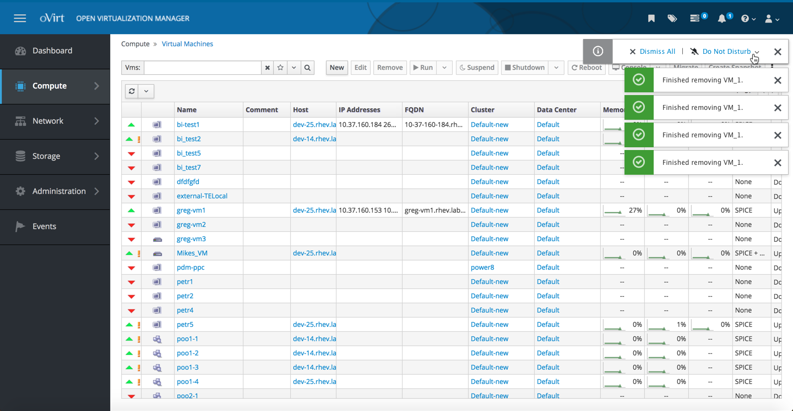

# Notifications

The Notification Drawer and Toast Notifications are used within oVirt to let the user know about tasks that have been kicked off along with any state changes or alerts.

### Toast Notifications
Today, a number of toast notifications can be triggered all at one time. They will stack up so that the user can see them. In the case that the user wants to avoid a notification storm, we are considering adding a way to dismiss all notifications that have stacked up along with a way to turn of 'Do Not Disturb' for a certain amount of time.

The ideal solution is to work towards combining like notifications to reduce the amount that are fired at once.

### Toast Notifications - Do Not Disturb
If more than two toast notifications appear, a ‘Dismiss All’ and ‘Do Not Disturb’ actions appear. The user can use either of these actions to silenece toast notifications for a certain period of time. 

To view the full toast notifications do not disturb design documentation you can view it and comment on it here: https://docs.google.com/document/d/18Hevso2rEafjuMC8zC7LgacXN8XJLZaQLdJ0riHtySo/edit?usp=sharing
