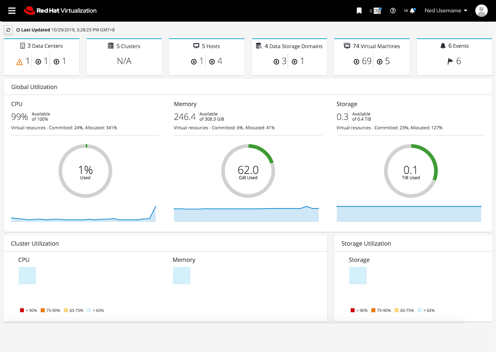
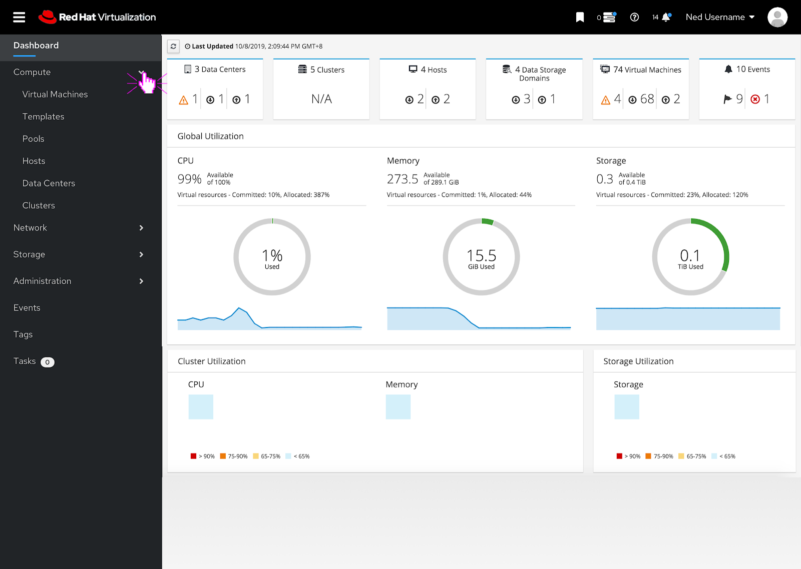
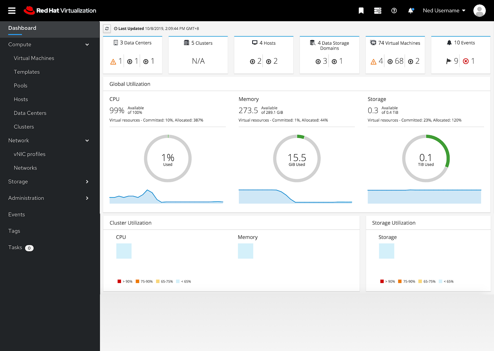
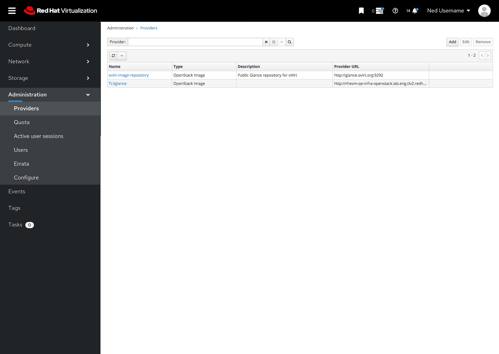

### Masthead and Vertical Navigation
The PatternFly 4 designs for the masthead and vertical navigation feature an updated visual design based off of PatternFly 4 components. 

If the user clicks on the hamburger menu, the vertical navigation can be fully collapsed or expanded.   

To expand a section the user can click on the caret and the sub menu items appear below the expanded caret.  

The user can have multiple sub menus expanded at the same time. 

If a user selects a menu item, the item and the sub menu section become highlighted. The content area reflects the menu selection as well.    

To view the full PatternFly4 masthead and vertical navigation design documentation you can view it and comment on it here: https://docs.google.com/document/d/19-70hjizz6QFVORhVQbA986jyl9T8NRvi-kQCZEDTiM/edit?usp=sharing