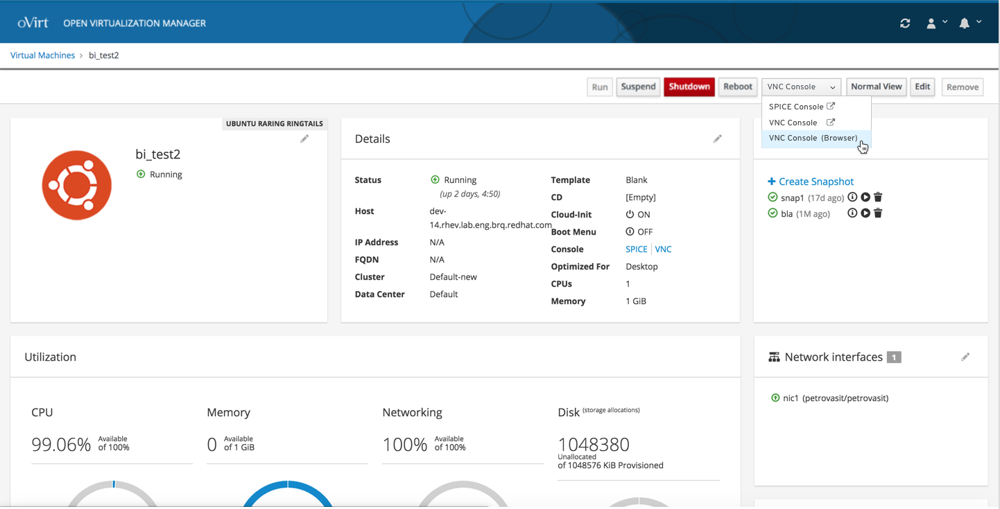
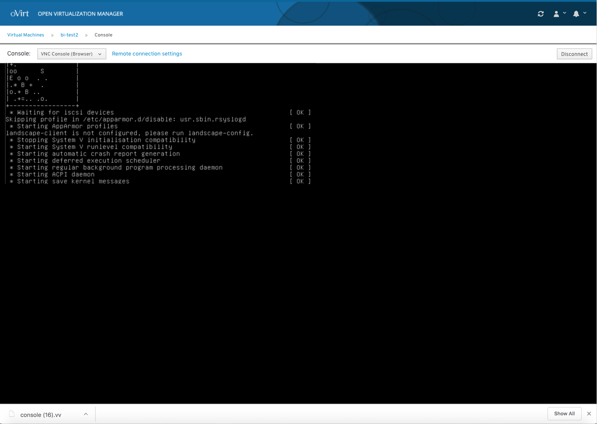

### Console
The user clicks on the console button of a specific VM to access the console. The user can select from different types of console types. 

If the user selects an in browser console type, the console will appear in the user's browser. 

To view the full console design documentation you can view it and comment on it here: https://docs.google.com/document/d/1m-pM0VVgeZmVCJFs2lLuzC9KUVV-X1cDfLXPboMWuBA/edit?usp=sharing
