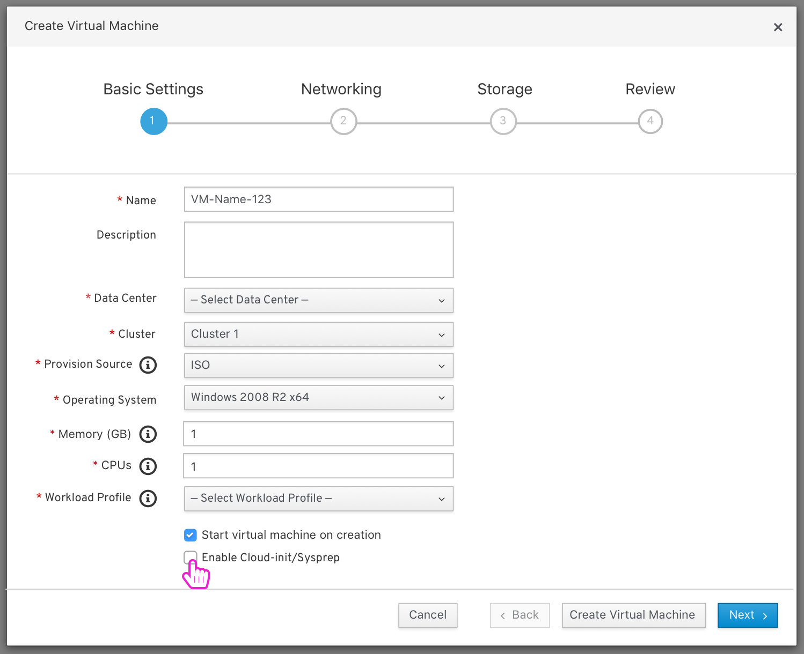
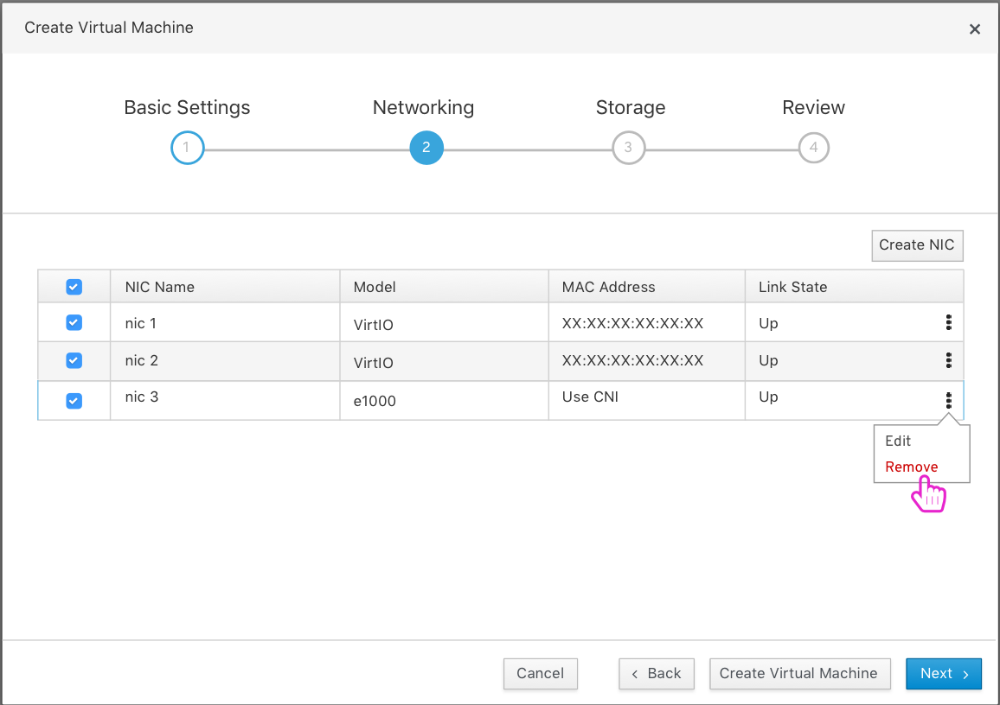
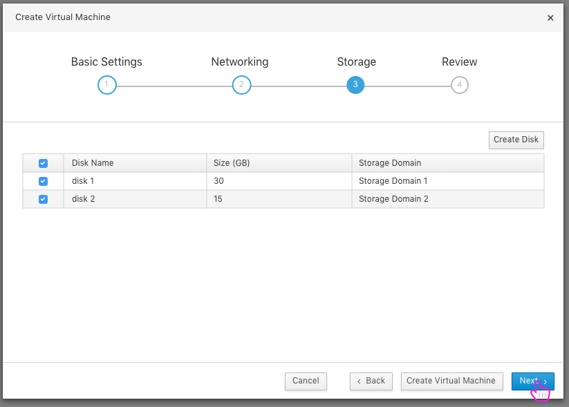
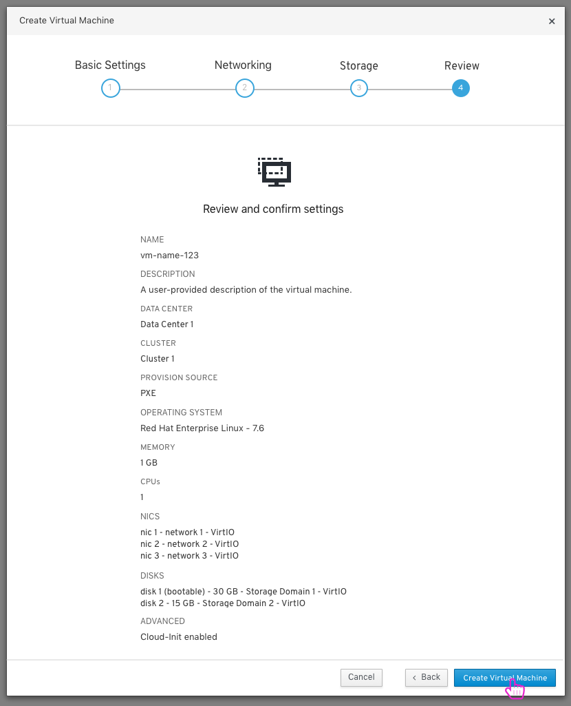
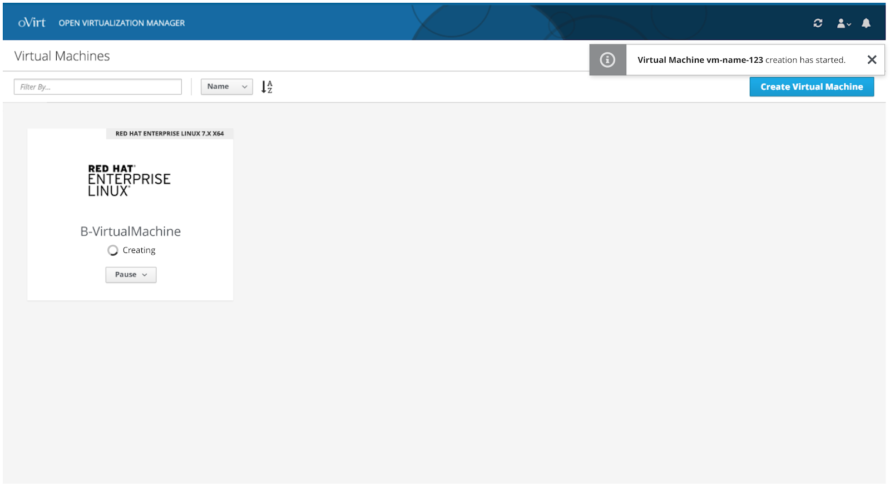

### Create New VM
To create a new VM, the user clicks the 'Create Virtual Machine' button and a 'Create Virtual Machine' modal appears where the user can start to fill out basic setting information for a new VM. 

At the second step the user can configure the network settings of the VM.

At the third step the user can configure the storage settings of the VM. 

At the final step the user can review the selected settings of the VM and create the VM.

A toast notification appears and lets the user know that the VM is bring created. Once the VM is done being created it will appear on the 'Virtual Machines' page.  

To view the full create new VM design documentation you can view it and comment on it here: https://docs.google.com/document/d/1UtFhNa_1byMV5mLEJ1MbdvZj-uMpmsD-_bJ37JDcyjU/edit?usp=sharing