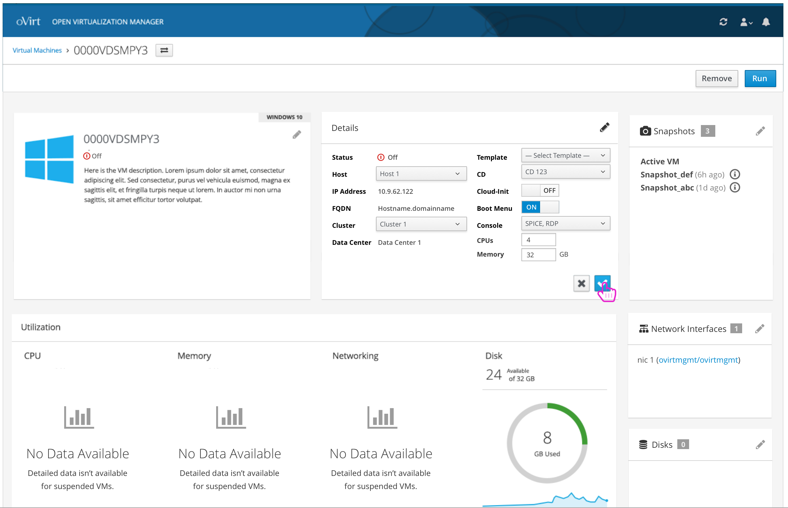
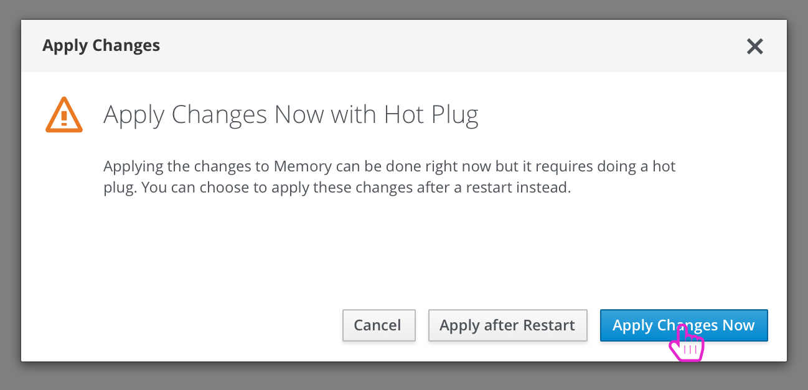

# Making Edits to a Virtual Machine
The user can make edits to any portion of the VM details by interacting with each card.

### Edit Name and Description
Editing the name and description is contained in the first card:

### Edit Basic Details
Editing the basic details about the VM is in the 2nd card. This includes changing how much CPU and Memory resources should be given to this VM:

### Next Run Configuration Changes
In come cases, edits won't be applied until the next run of the VM. The user will be notified via a confirmation modal along with a notification until a reboot is done.

### Option to Hot Plug Changes
In a few cases, the user can choose to Hot Plug changes to the configuration. In this case, a confirmation should be given to the user to choose whether they want to hot plug the changes or want until the next reboot of the VM to apply the changes.

If the user chooses to Apply after Reboot, they will get a similar informational inline notification as with the next run configuration changes.
