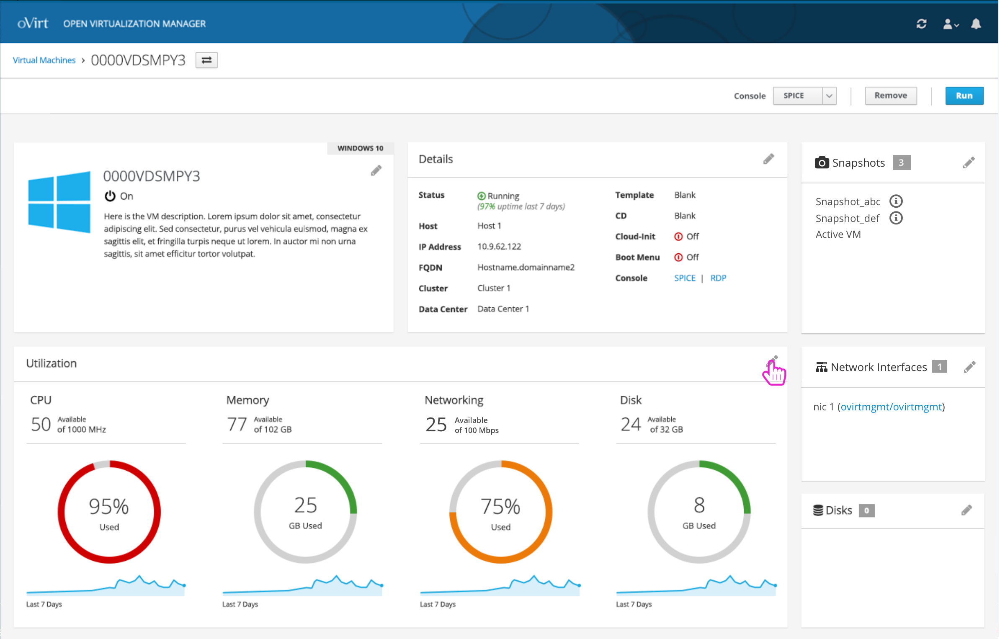
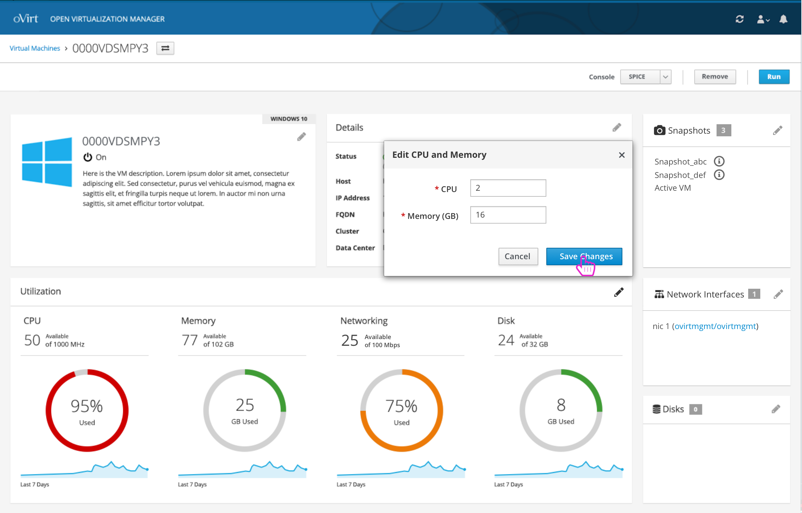

# Making Edits to a Virtual Machine
The user can make edits to any portion of the VM details by interacting with each card.

### Edit Name and Description
Editing the name and description is contained in the first card:

### Edit Basic Details
Editing the basic details about the VM is in the 2nd card:

### Edit CPU and Memory
The edit icon can be used on the Utilization card to define how much CPU and Memory resources should be given to this VM.

