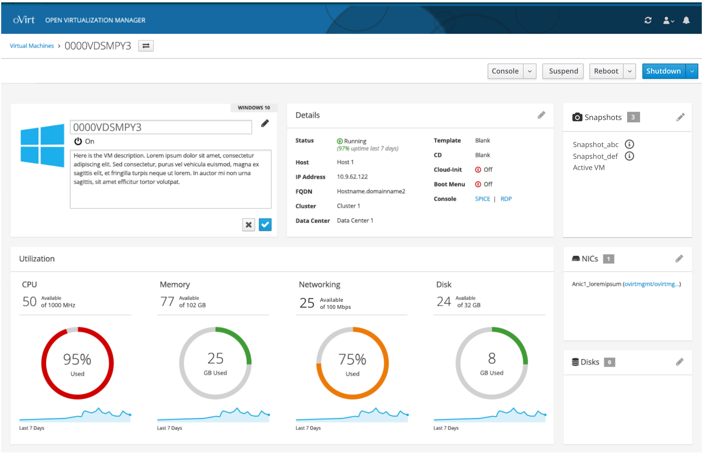
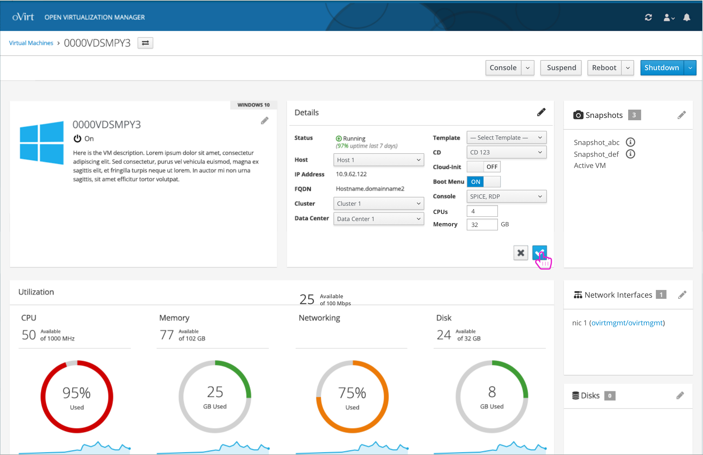
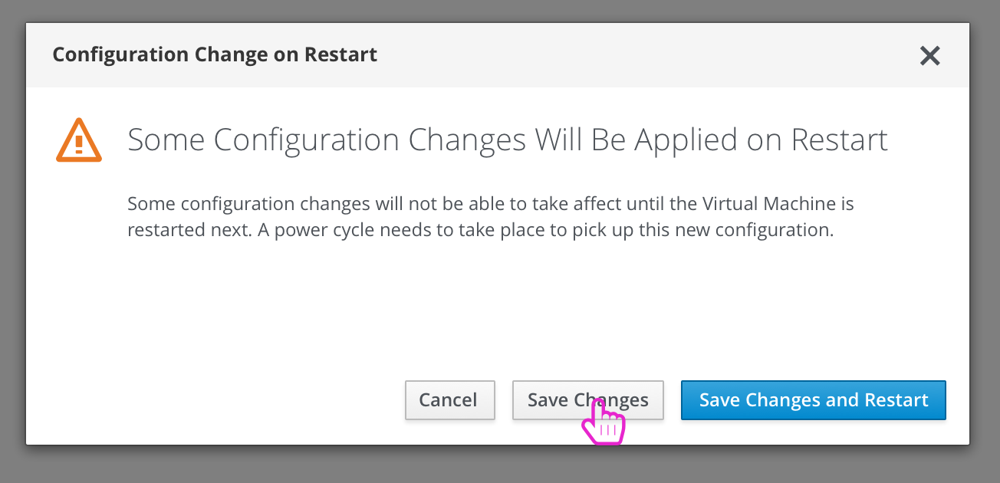
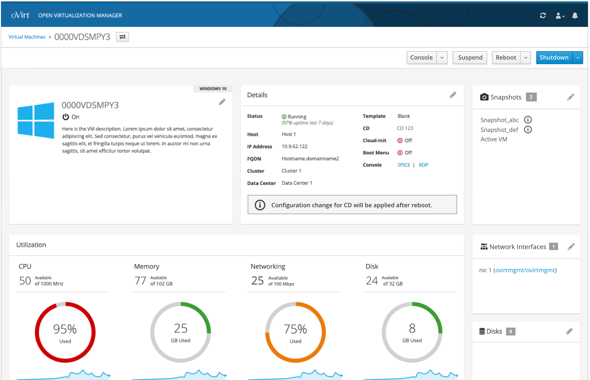

# Making Edits to a Virtual Machine
The user can make edits to any portion of the VM details by interacting with each card.

### Edit Name and Description
Editing the name and description is contained in the first card:

### Edit Basic Details
Editing the basic details about the VM is in the 2nd card. This includes changing how much CPU and Memory resources should be given to this VM:

### Next Run Configuration Changes
In come cases, edits won't be applied until the next run of the VM. The user will be notified via a confirmation modal along with a notification until a reboot is done.

