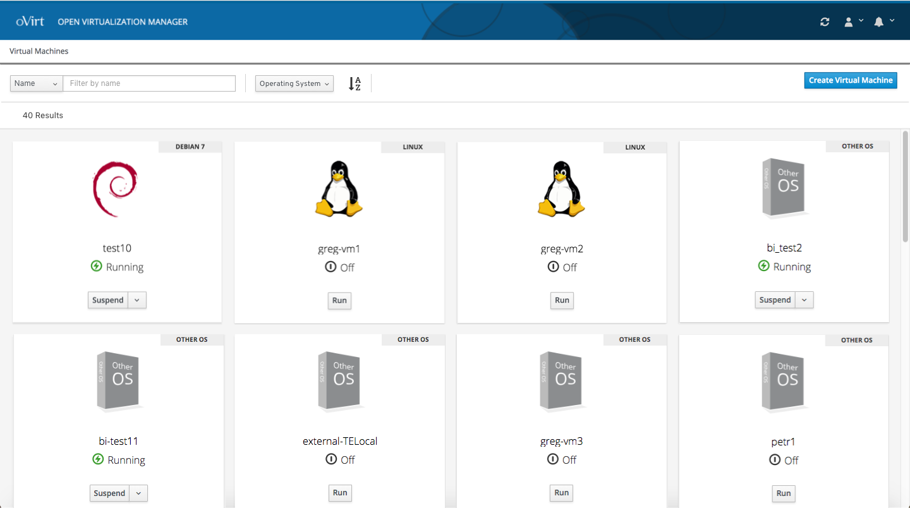
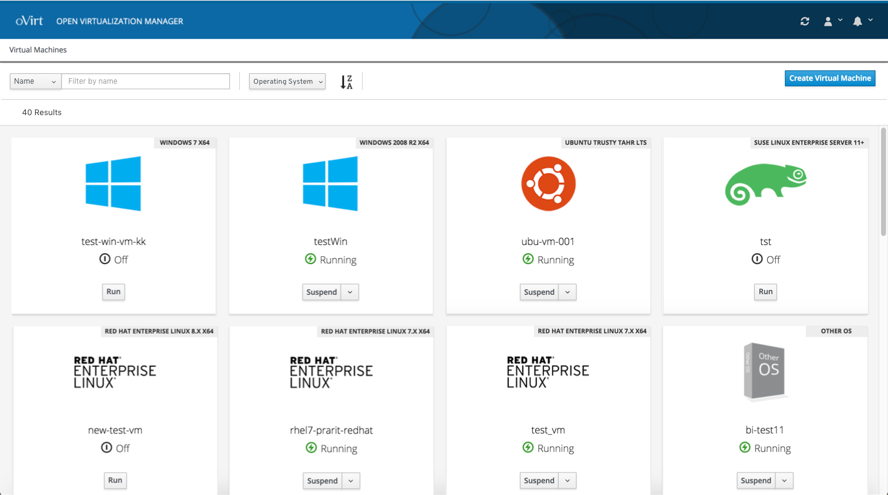
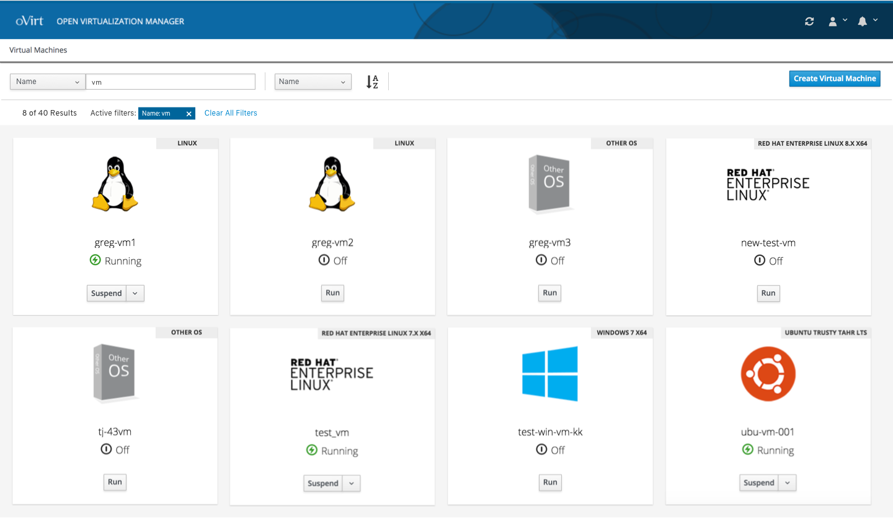

### Filter and Sort
To further refine the list of VMs, the user can use the filter and sort options featured in the toolbar.  

The user can sort the list of VMs by alphabetical order or reverse alphabetical order. 

The user can enter a search term and the list of VMs is filtered to only show the VMs that feature that search term.  

To view the full console design documentation you can view it and comment on it here: https://docs.google.com/document/d/1m-pM0VVgeZmVCJFs2lLuzC9KUVV-X1cDfLXPboMWuBA/edit?usp=sharing