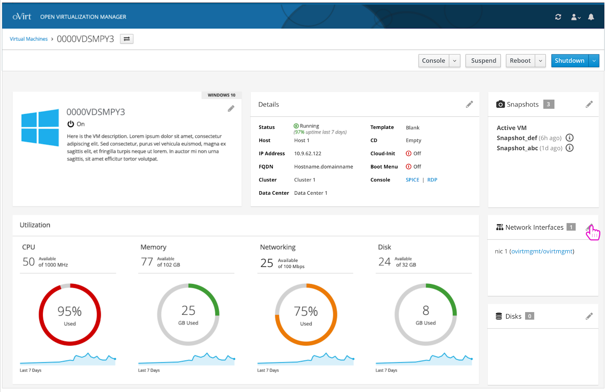
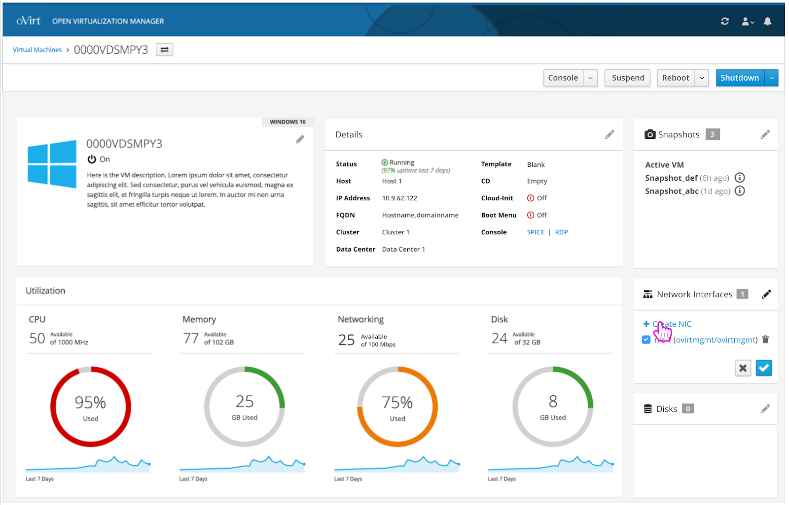
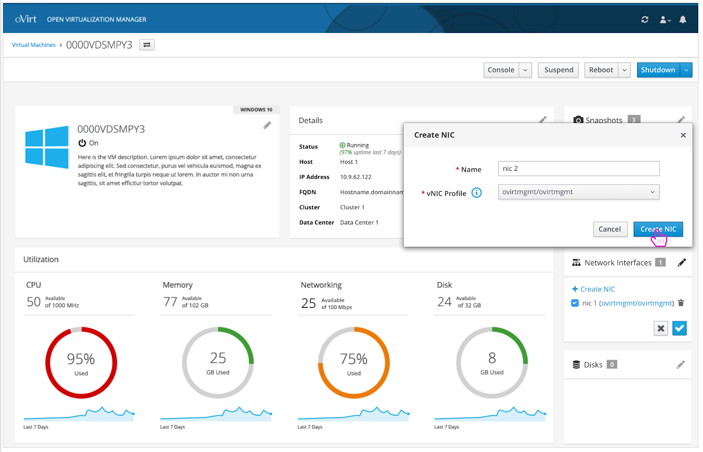
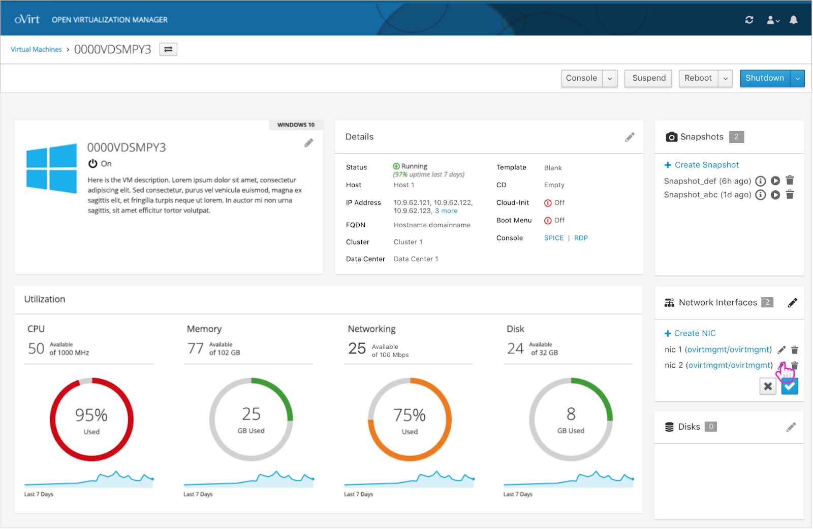
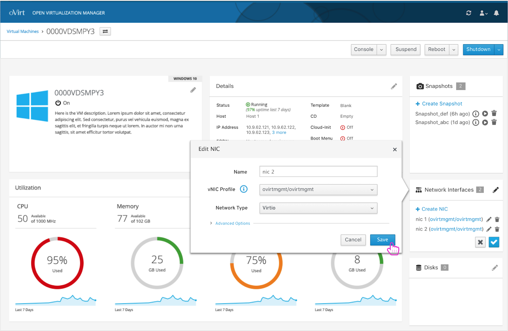
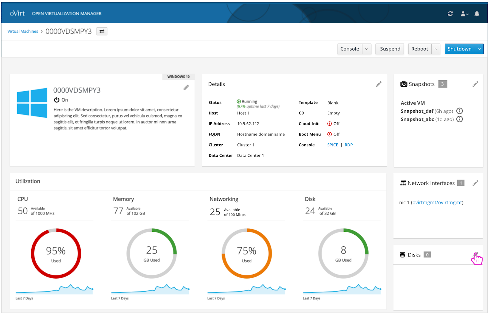
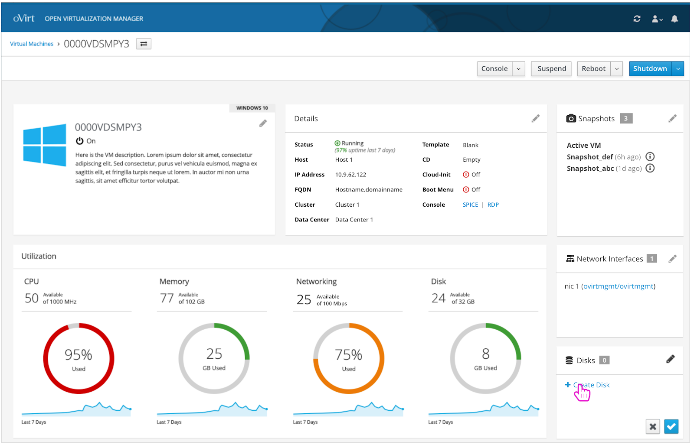
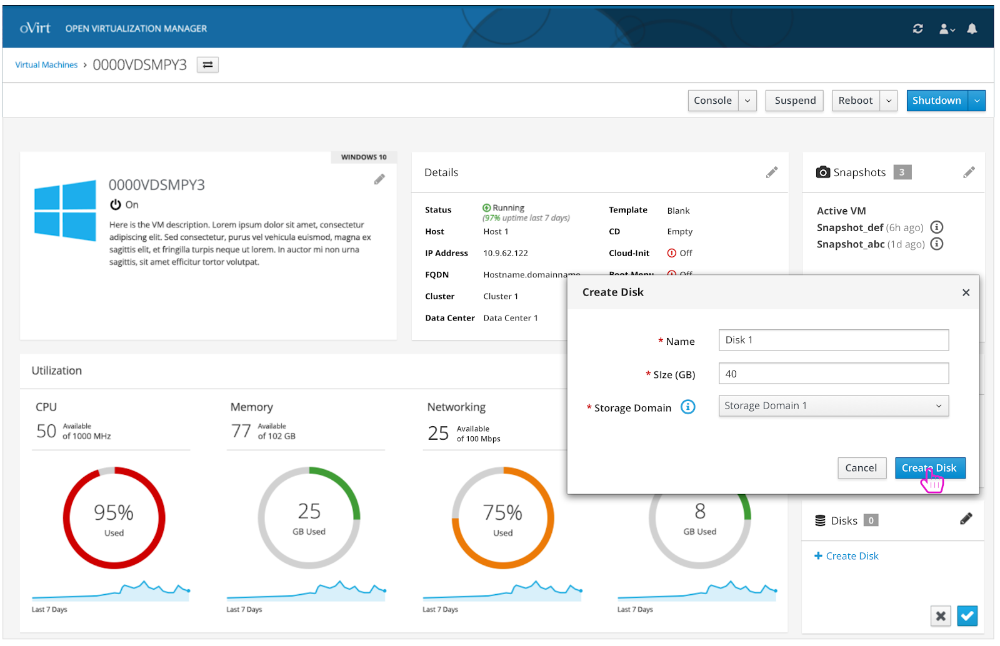
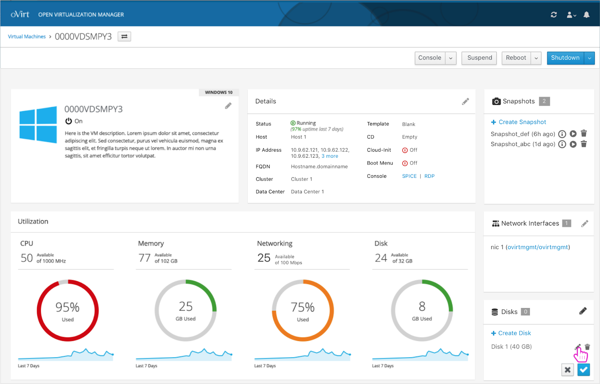
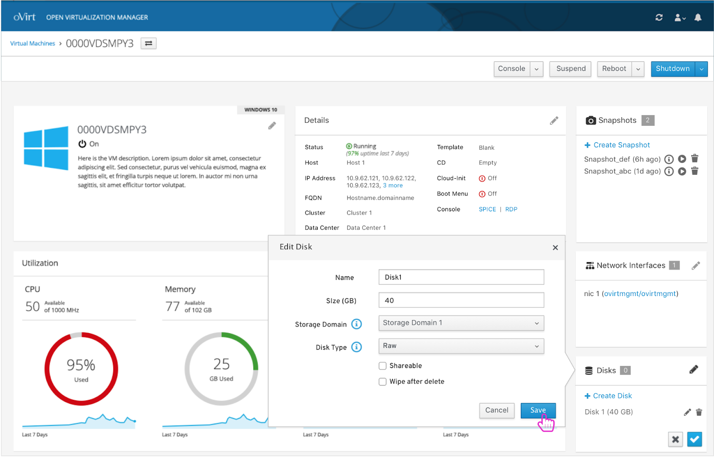

# NICs and Disks
The user can create and edit NICs and disks from the cards on the VM's dashboard. 

### NICs
To edit the network interfaces of a VM, the user must first click the pencil icon on the NICs card.   

### Create NIC
The user can create a new network interface by clicking the 'Create NIC' button.

### Create NIC- Select Criteria
A 'Create NIC' modal appears and the user can select a name and a vNIC profile for the NIC.   

### NIC Appears
A newly created NIC appears and the user can edit it.  

### Edit NIC
An 'Edit NIC' modal appears and the user can make updates to the selected NIC.  

### Disks
To edit the disks of a VM, the user must first click the pencil icon on the disks card.   

### Create Disk
The user can create a new disk by clicking the 'Create Disk' button.

### Create Disk- Select Criteria
The user selects a name, size, and storage domain for the new disk.    

### Disk Appears
A newly created disk appears and the user can edit it. 

### Edit Disk
An 'Edit Disk' modal appears and the user can make updates to the selected disk.

### NICs and Disks Design Documentation
To view the full NICs and disks design documentation you can view it and comment on it here: https://docs.google.com/document/d/1OdYN_qxh2ri-DltcwWdaBDnLjJc22OOPDrshfdUPcUg/edit?usp=sharing
