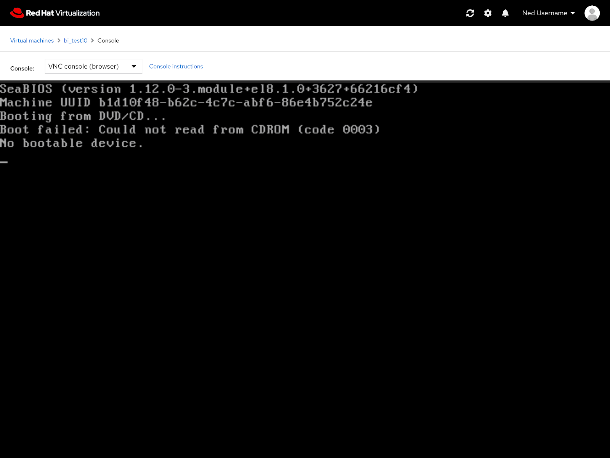
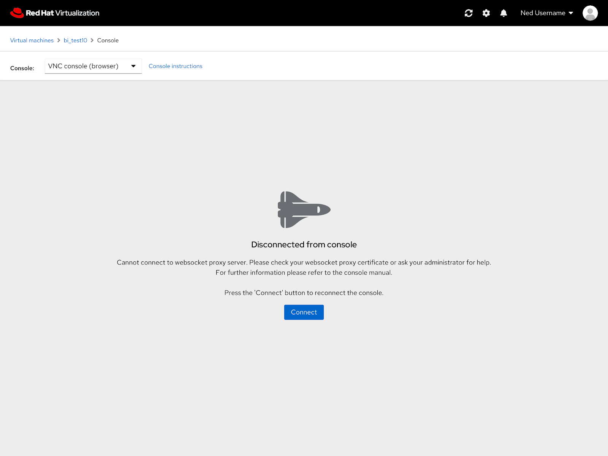
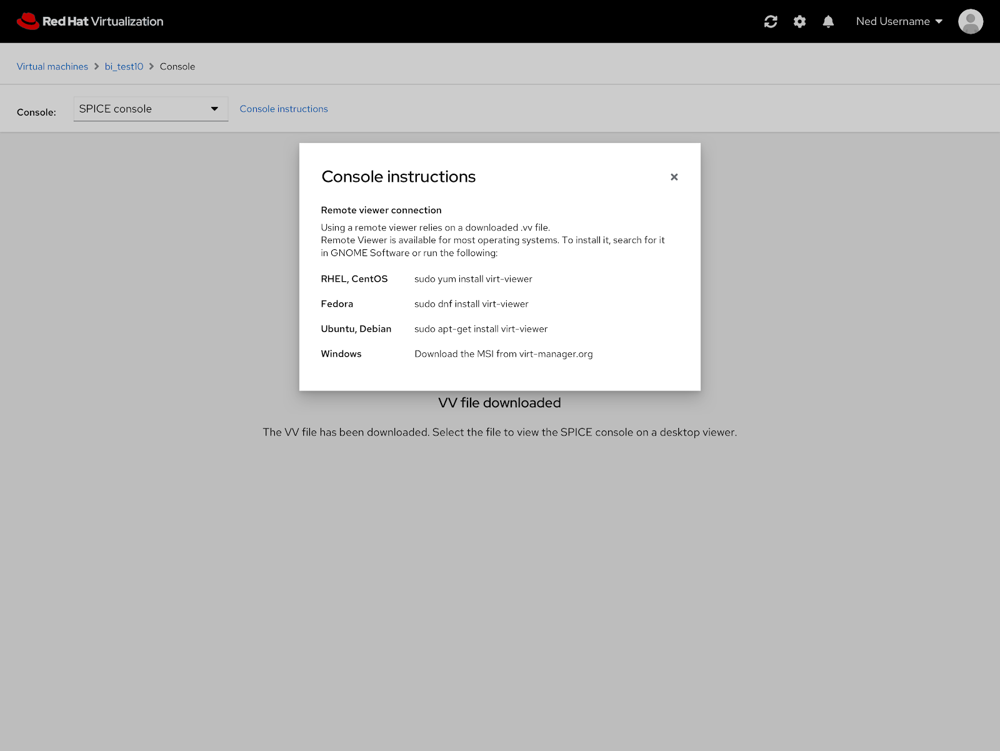

# PatternFly 4 Console
The PatternFly 4 version of the console features the same functionality as the current console but an updated look. 

### Empty State
The empty state of the console features an updated look but the content is still the same as the current console.  

### Console Instructions
Same goes for the console instructions modal.  

### PatternFly4 Console Design Documentation
To view the full console in PatternFly 4 documentation you can view it and comment on it here: https://docs.google.com/document/d/1yNiix44DuKAcp7kTgIL0q83AuhTwjAg_SZ7ZlfqPfzA/edit?usp=sharing
