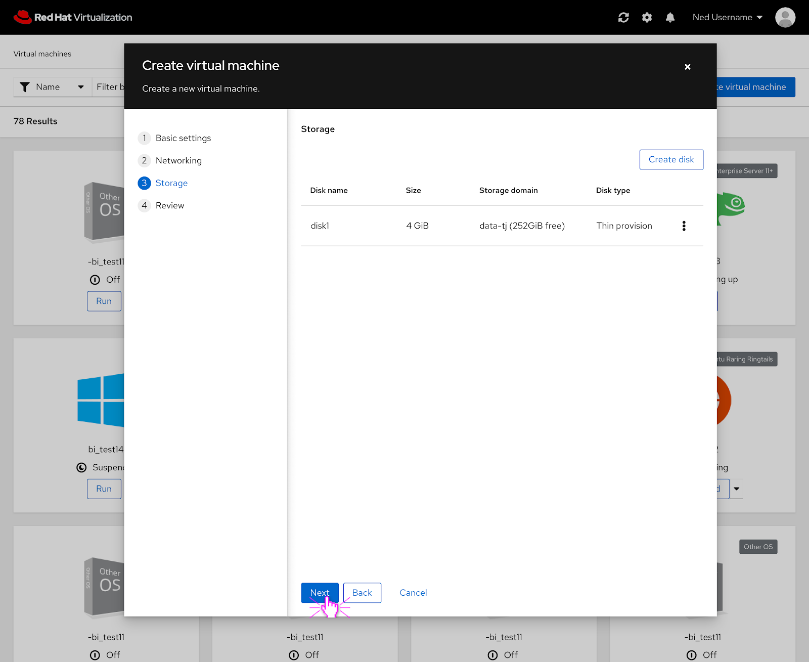

# PatternFly 4 Create New VM

### Create New VM
The PatternFly 4 version of the create new VM modal features the same functionality as the current one but an updated look. 

### Create New VM- Create NIC
If the user were to create a NIC for the VM, this is what it would look like in PatternFly 4. 

### Create New VM- Create Disk
If the user were to create a disk for the VM, this is what it would look like in PatternFly 4.

### Create New VM- Review
The user can review their selections before creating the VM.

### Create New VM- VM is Being Created
The top part of the review screen features the status of the VM that is being created.  

### Create New VM Design Documentation
To view the full create new VM in PatternFly 4 documentation you can view it and comment on it here: https://docs.google.com/document/d/1C3fPUPdkM2Bd8E1t1n0M_MBv9rq1wHfGzXmNltUv1c4/edit?usp=sharing
