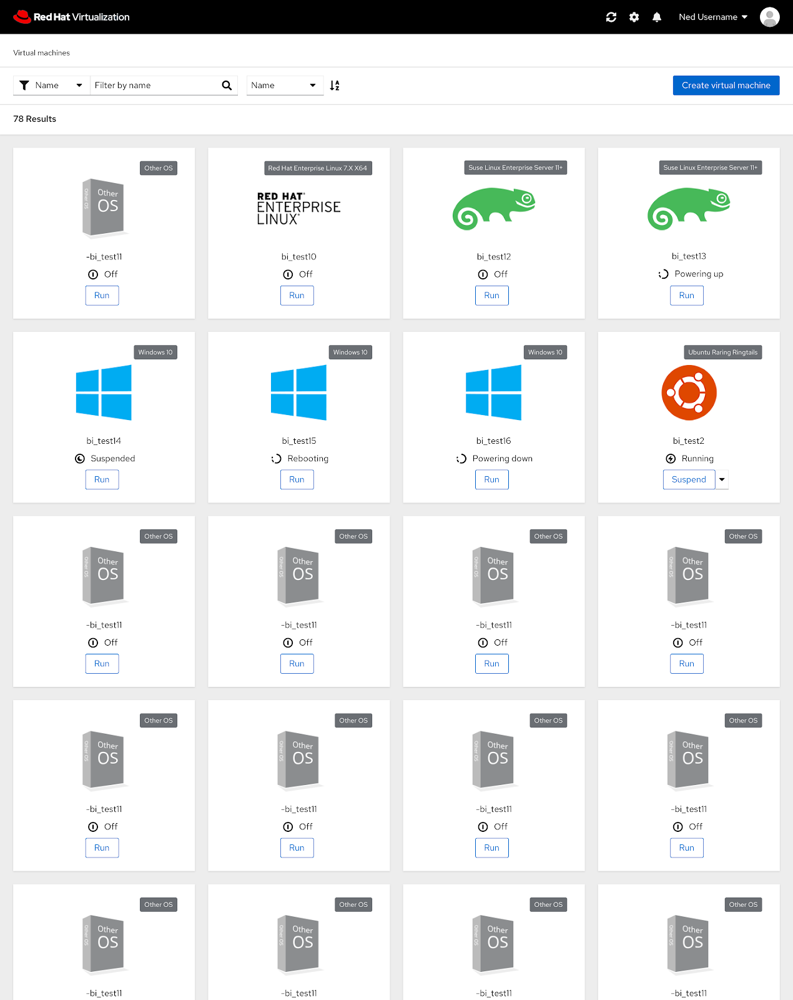
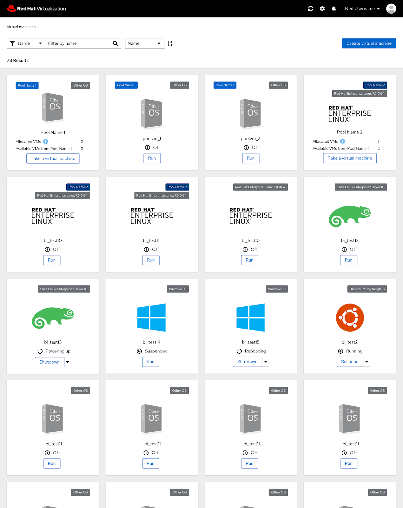
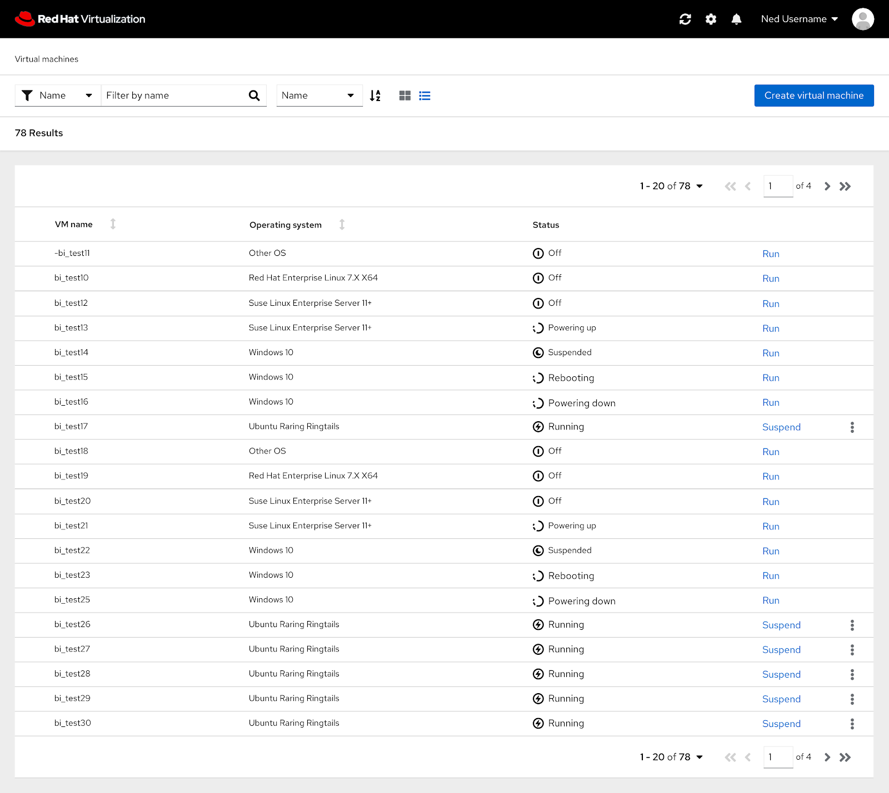

# PatternFly 4 User Portal Homepage

### User Portal Homepage
The PatternFly 4 version of the user portal homepage features the same functionality as the current homepage but an updated look. 

### Pools
If the user has pools or VMs from a pool, this is what the homepage in PatternFly 4 would look like. 

### List View
One feature proposed in the PatternFly 4 designs includes adding a list view to the user portal homepage. The list view allows the user to view more VMs in one place in comparison to the card view.  

### User Portal Homepage Design Documentation
To view the full user portal homepage in PatternFly 4 documentation you can view it and comment on it here: https://docs.google.com/document/d/1jdEZCu-bZRr2y1sH97m-Oooufilnr_u-v7Gu9nyXrpw/edit?usp=sharing
