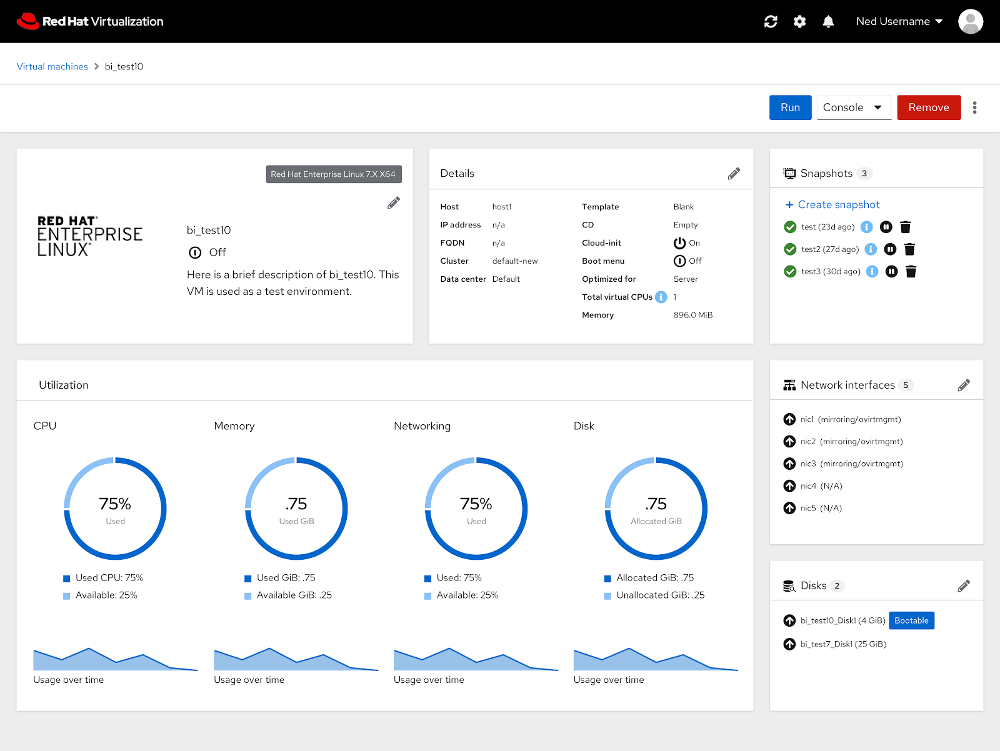
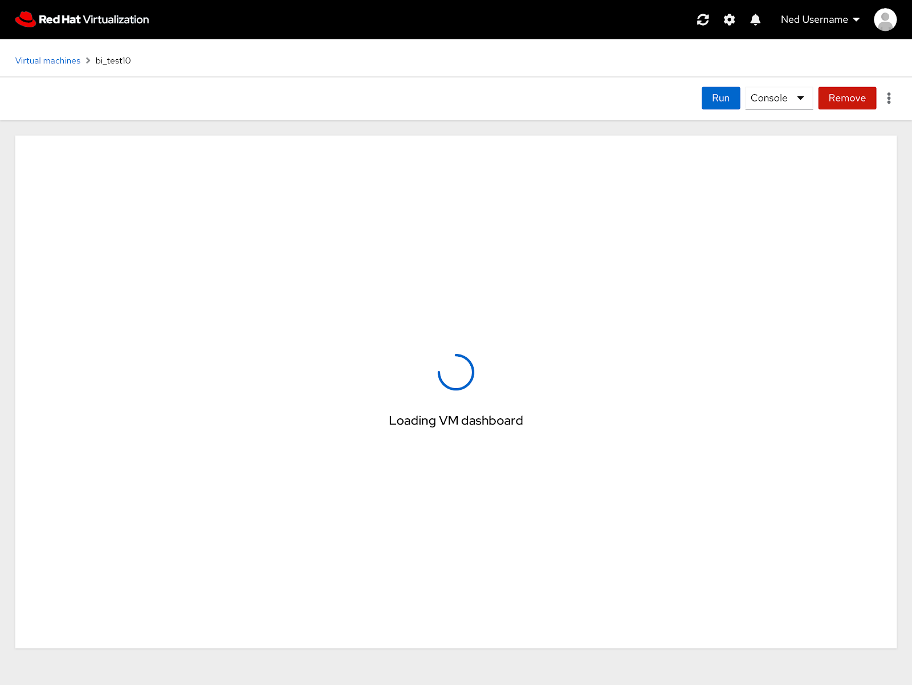
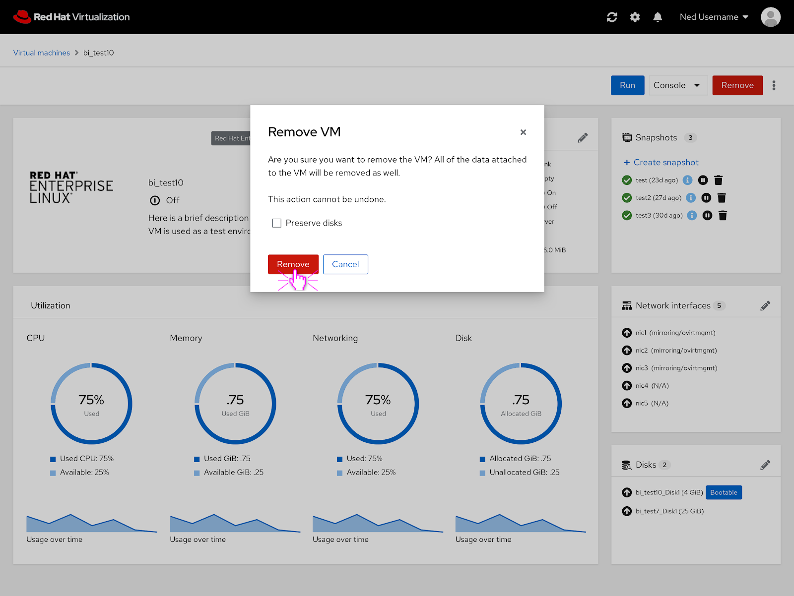

# PatternFly 4 VM Dashboard

### Updated VM Dashboard
The PatternFly 4 version of the VM dashboard features the same functionality as the current one but an updated look. 

### Loading VM Dashboard
If the VM dashboard is loading, a loading spinner appears in the content area while the VM dashboard loads.  

### Modal Dialog
What a modal dialog would look like in PatternFly 4.

### VM Dashboard Design Documentation
To view the full VM dashboard in PatternFly 4 documentation you can view it and comment on it here: https://docs.google.com/document/d/1HF9-0biA_r80jtPEiLvxiIlK7cMprT93hNJmKcpmtkw/edit?usp=sharing
