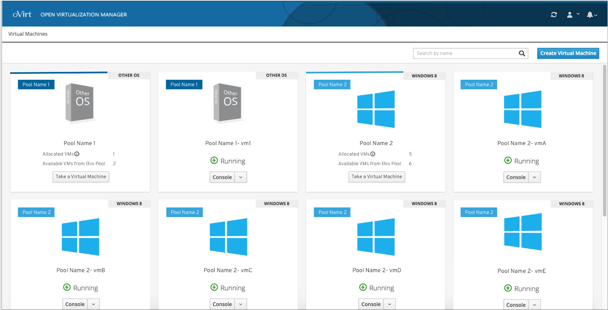

# Pools

### Allocated VMs
If the user has access to a certain pool of VMs, the user can take a certain number of allocated VMs from the pool.   

### Taking a VM from a Pool
If a user takes a VM from a pool, the allocated VM will appear next to the pools card on the right.

### Pool Label
If a VM is from a pool, the VM dashboard features a label with the pool name attached on it.   

### Pools Design Documentation
To view the full pools design documentation you can view it and comment on it here: https://docs.google.com/document/d/1G8ROKv_Talwh3c_drDglxM03zdOWoW-cAWt2-2zVqqk/edit?usp=sharing
