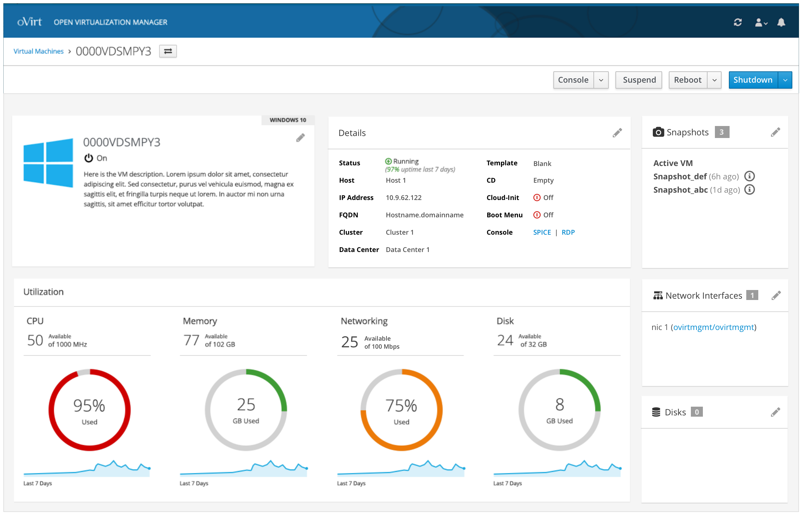
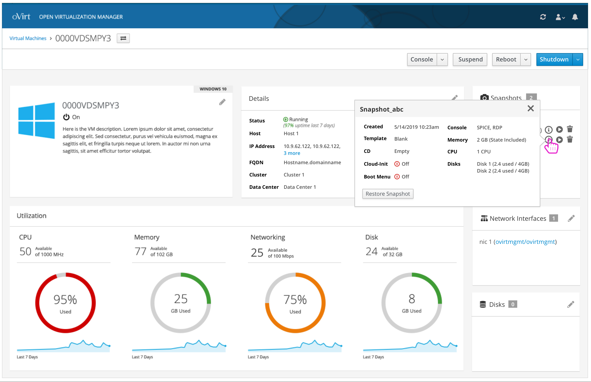
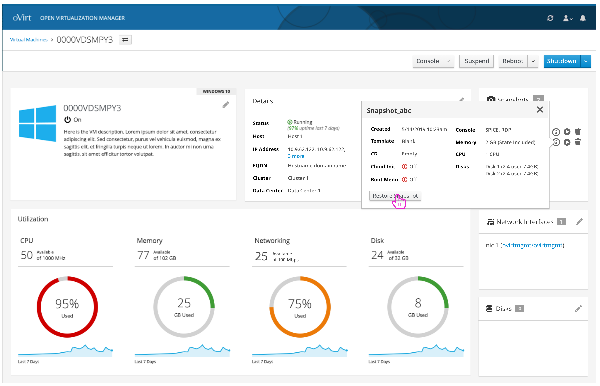
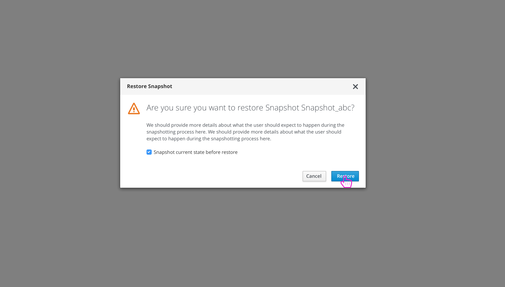
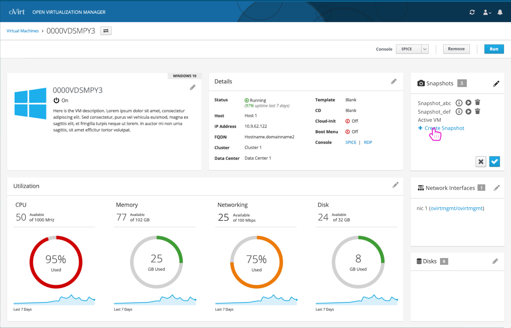
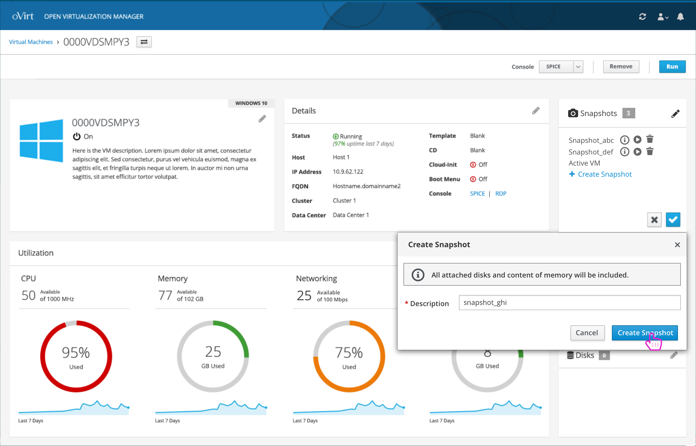
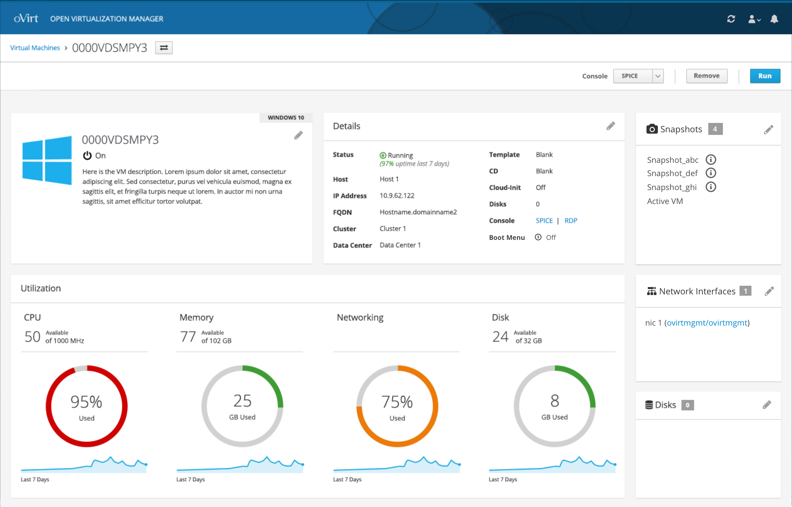
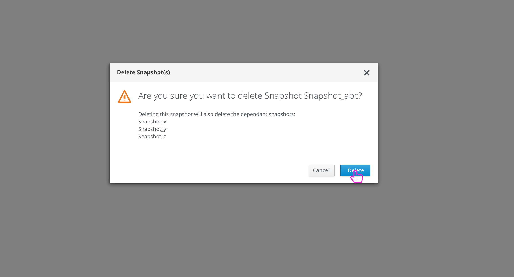

# Snapshots
Users will have the ability to manage snapshots for each VM.

### View Snapshots
Within the details page, the user will be able to see a card that lists all of the snapshots for the VM.

The user can hover over the information icon to view some high level details about that snapshot.

### Restore Snapshot
If the user wants to restore a snapshot, they will be given a confirmation modal before proceeding.

### Create Snapshot
Within the edit mode of the snapshots card, the user can Create a Snapshot.

### Delete Snapshot(s)
Deleting a snapshot should give the user a confirmation dialog. In some cases, other dependent snapshots would be deleted as well and this should be clear to the user.

