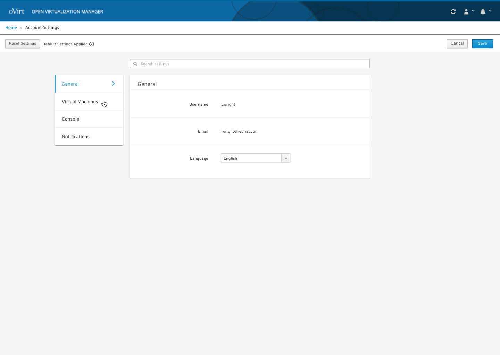
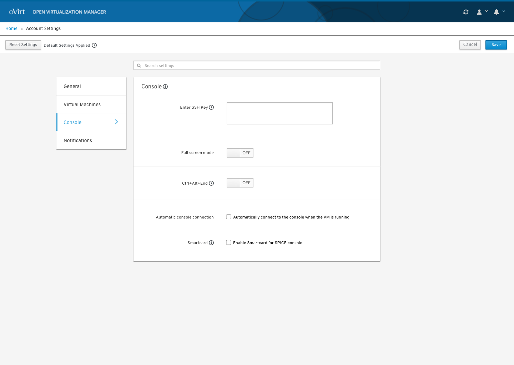

# User Settings

### Acessing User Settings
A user can access account wide settings and make application wide settings changes. 

### Selecting User Settings
The user can set application wide settings for features like the console.  

### Settings User Design Documentation
To view the full user settings design documentation you can view it and comment on it here: https://docs.google.com/document/d/1apA6E4zT21JSJgeO2V3Q_LhK9xq4SOwNeD-gIsG5pNY/edit?usp=sharing
