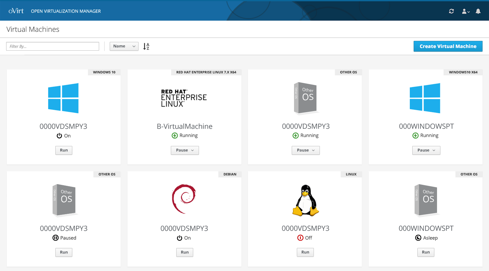
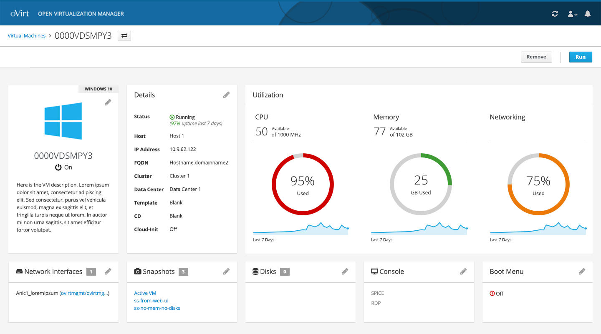
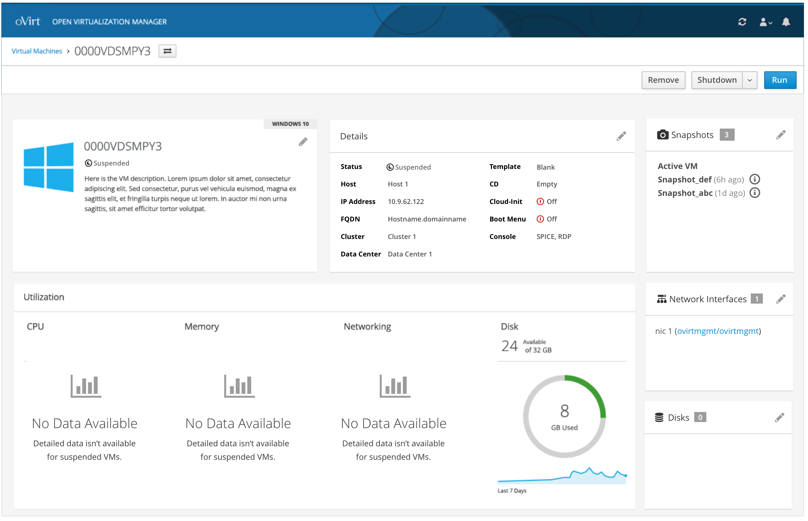
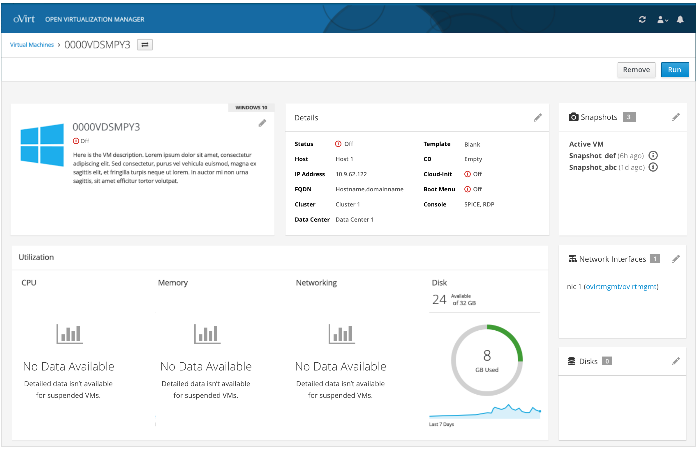

# Virtual Machines List and Details
Once logged in, the user can view any VMs that have already been created. This includes VMs in any state.

### Virtual Machines Card View
From this level, the user can change filter the list along with view the high level details of the VMs shown. The state of each VM is a primary detail along with the primary action that can be taken. Additionally, from this view the user can Create a New VM.

### Virtual Machine Details - Running
Clicking on a specific Virtual Machine will give the user more details about that VM. These details include:
* Basic information about the VM (Status, Host, IP Address, FQDN, Cluster, Data Center, Template, CD, and Cloud-Init, Console access, and Boot Menu)
* Utilization metrics for CPU, Memory, Network, and Disk
* NICs
* Snapshots
* Disks

Depending on the state of the VM, the user will have access to different actions.

### Virtual Machine Details - Suspended
If the VM is suspended, the state will be updated along with the actions that can be taken. The user won't be able to access the console any more and there won't be any utilization details available for CPU, Memory and Networking.

### Virtual Machine Details - Off
Similar to a suspended VM, if the VM is off, the state will be updated along with the actions that can be taken. The user won't be able to access the console any more and there won't be any utilization details available for CPU, Memory and Networking.

